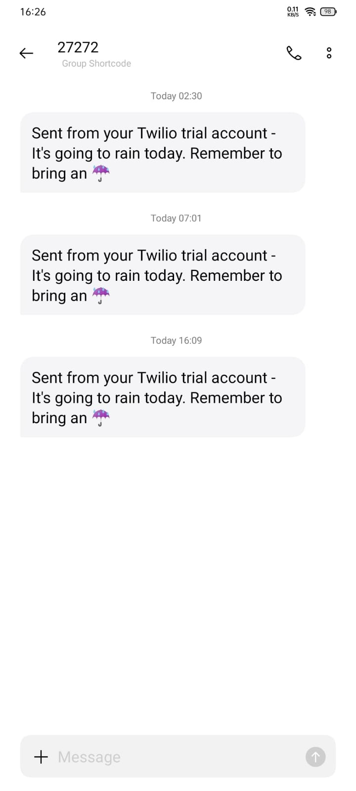

This app sends a SMS to your phone if will rain 

Don’t forget create a file .env and include the next constants:

- ACC_SID = Your Account SID from https://www.twilio.com/
- AUTH_TOKEN = Your Authorization Token from https://www.twilio.com/
- API_KEY = Your API_KEY from https://openweathermap.org/
- TEL_TWILIO = Phone that they give you in TWILIO
- RECIPIENT = Destination phone number
- LAT = Latitude
- LON = Longitude

Example:
API_KEY = “123456qwerty789”

You can add on https://www.pythonanywhere.com/ task and automate the message to take your umbrella before leaving home

